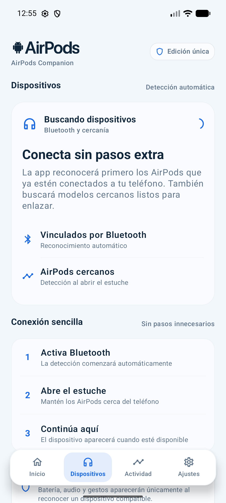
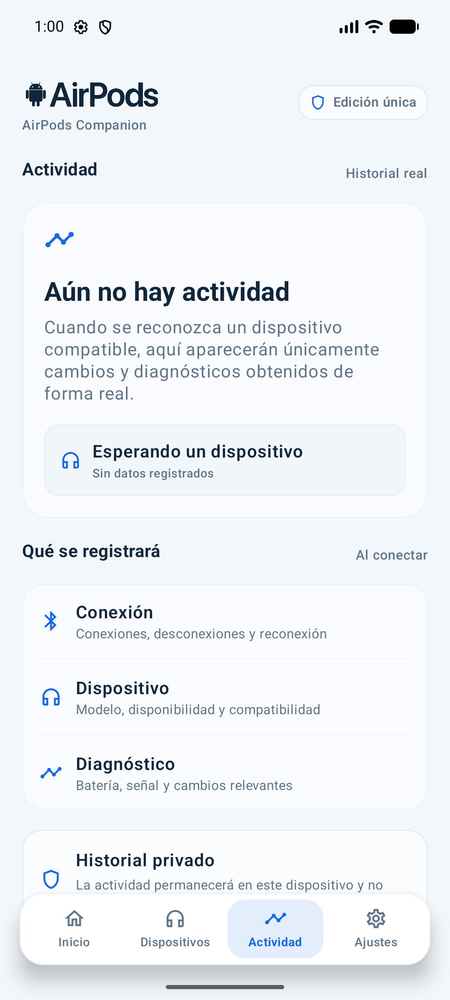

<p align="center">
  
</p>

<h1 align="center">AirPods Companion</h1>

<p align="center">
  Consulta desde Android la conexión, batería, audio y compatibilidad que tus AirPods publiquen realmente.
</p>

<p align="center">
  <a href="https://github.com/neydermarquez/AirPodsCompanion/releases/latest">
    
  </a>
  
  
</p>

## Qué es

AirPods Companion es una aplicación independiente para Android que reconoce AirPods vinculados o conectados y presenta únicamente la información que Android y el dispositivo hacen disponible. No requiere root, una cuenta de Apple ni modificaciones del sistema.

La interfaz diferencia los datos actuales, las lecturas antiguas y las funciones que Android no permite controlar. No utiliza valores simulados para aparentar compatibilidad.

## Capturas

<p align="center">
  
  
  
  
</p>

## Funciones principales

- Reconocimiento automático de AirPods vinculados y conectados.
- Búsqueda de dispositivos cercanos y emparejamiento mediante Android.
- Estado real de Bluetooth, conexión, desconexión y reconexión.
- Batería general o individual cuando el modelo la publique.
- Vigencia y fuente de cada lectura de batería.
- Controles multimedia compatibles: reproducción, pausa, pistas y volumen.
- Diagnóstico de rutas multimedia, micrófono y llamadas.
- Audio espacial y seguimiento de cabeza cuando Android los exponga.
- Historial local de conexiones, errores y diagnósticos.
- Notificaciones configurables y supervisión opcional en segundo plano.
- Widget de conexión y batería.
- Información de compatibilidad por modelo y capacidad.
- Exportación y eliminación de los datos locales.

## Estados transparentes

Cada capacidad se presenta con un estado explícito:

- **Controlable:** la aplicación puede ejecutar la acción.
- **Detectable:** Android publica el estado, pero no necesariamente permite cambiarlo.
- **Control físico:** depende de los controles del auricular.
- **Gestionado por Android:** el sistema o el reproductor son responsables.
- **No disponible:** Android no ofrece una API pública compatible.
- **Pendiente de evidencia:** requiere validación reproducible con hardware real.

Funciones propietarias como Buscar, iCloud, Siri, actualización de firmware y personalizaciones exclusivas del ecosistema Apple no se presentan como disponibles en Android.

## Descargar e instalar

1. Abre la [última versión publicada](https://github.com/neydermarquez/AirPodsCompanion/releases/latest).
2. Descarga `AirPods-Companion-v1.0.0.apk`.
3. Abre el archivo en tu dispositivo Android.
4. Si Android lo solicita, autoriza temporalmente la instalación desde el navegador o gestor de archivos.

Requiere Android 7.0 (API 24) o posterior. El archivo `.aab` de la publicación está destinado a Google Play y no se instala directamente.

### Verificar la descarga

La publicación incluye `SHA256SUMS.txt`. En Windows puedes comprobar el APK con:

```powershell
Get-FileHash .\AirPods-Companion-v1.0.0.apk -Algorithm SHA256
```

## Privacidad

- Procesamiento local.
- Sin publicidad.
- Sin cuenta de Apple.
- Sin recopilación de ubicación.
- Sin transmisión automática de diagnósticos.
- Historial y evidencia técnica eliminables desde la aplicación.

Consulta la [política de privacidad](docs/legal/PRIVACY_POLICY.md) y la [declaración de independencia](docs/legal/APPLE_INDEPENDENCE_NOTICE.md).

## Compilar el proyecto

Requisitos:

- Android Studio con JDK 11 o posterior.
- Android SDK 36.

En Windows:

```powershell
.\gradlew.bat assembleDebug
```

Para ejecutar pruebas y análisis:

```powershell
.\gradlew.bat testDebugUnitTest lintRelease
```

La firma de producción no forma parte del repositorio. Cada distribuidor debe configurar su propia clave siguiendo `keystore.properties.example`.

## Tecnología

- Kotlin
- Jetpack Compose
- Material 3
- Bluetooth Classic, A2DP y HFP
- DataStore
- Room
- Servicios y notificaciones de Android
- Widgets de aplicación

## Estado del proyecto

La versión pública actual es `v1.0.0`. La aplicación está compilada, firmada y disponible para instalación. La validación detallada de batería, carga, modos propietarios y sensores depende de disponer de cada generación de AirPods y teléfonos Android físicos.

Consulta la [trazabilidad funcional](docs/REQUIREMENTS_TRACEABILITY.md) y la [matriz de pruebas de hardware](HARDWARE_TEST_MATRIX.md) para conocer el estado exacto de cada área.

## Independencia

AirPods Companion es una aplicación independiente y no está afiliada, patrocinada ni aprobada por Apple Inc. AirPods y Apple son marcas de Apple Inc. La disponibilidad de funciones depende de las capacidades que Android y el dispositivo conectado publiquen.
