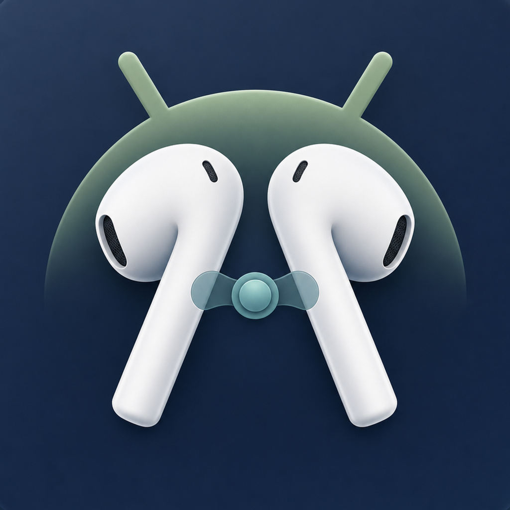
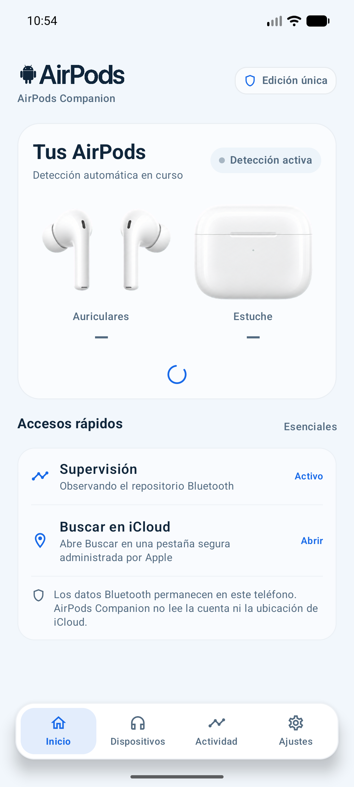
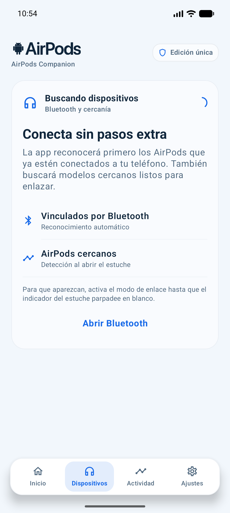
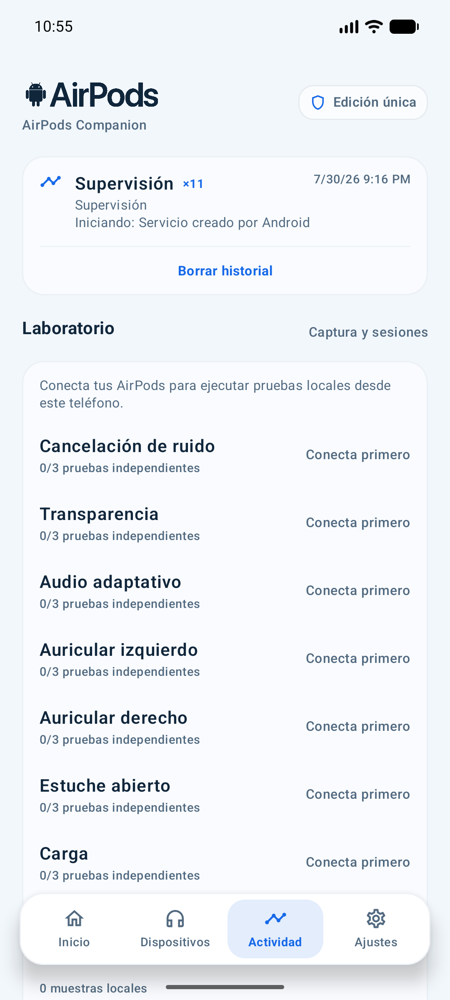
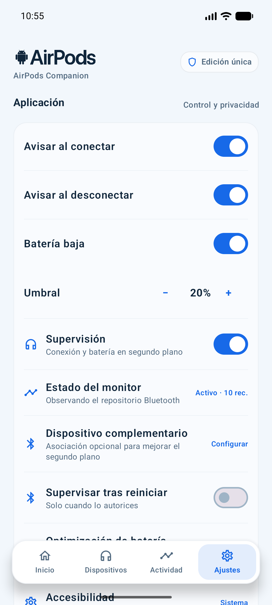
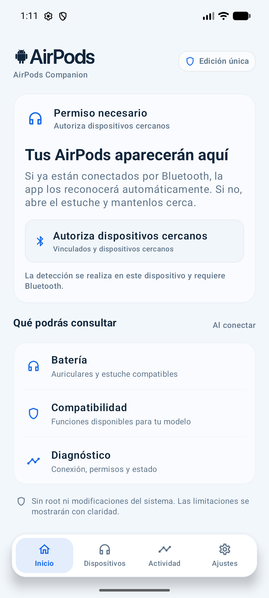
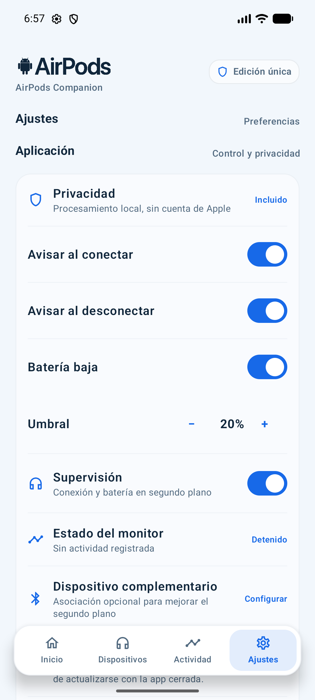

<p align="center">
  
</p>

<h1 align="center">AirPods Companion</h1>

<p align="center">
  Consulta desde Android la conexión, batería, audio y compatibilidad que tus AirPods publiquen realmente.
</p>

<p align="center">
  <a href="https://github.com/neydermarquez/AirPodsCompanion/releases/latest">
    
  </a>
  
  
</p>

<p align="center">
  <a href="https://github.com/neydermarquez/AirPodsCompanion/releases/download/v1.0.2/AirPods-Companion-v1.0.2.apk"><strong>Descargar APK v1.0.2</strong></a>
  ·
  <a href="https://github.com/neydermarquez/AirPodsCompanion/releases/latest">Ver publicación</a>
</p>

## Qué es

AirPods Companion es una aplicación independiente para Android que detecta AirPods vinculados, cercanos o conectados y reúne en una sola interfaz su estado de conexión, batería disponible, audio, actividad y compatibilidad. No requiere root, una cuenta de Apple ni modificaciones del sistema.

La interfaz diferencia los datos actuales, las lecturas antiguas y las funciones que Android no permite controlar. No utiliza valores simulados para aparentar compatibilidad.

La versión actual utiliza una interfaz clara única, con representación visual de los auriculares y el estuche, navegación inferior persistente y estados específicos para permisos, Bluetooth apagado, búsqueda, conexión, reconexión, pérdida de conexión y compatibilidad limitada.

## Novedades de v1.0.2

- Inicio renovado con representación visual de los AirPods y el estuche.
- Flujo simplificado de detección, vinculación y reconexión.
- Actualización inmediata mediante eventos Bluetooth y comprobación periódica de respaldo.
- Lecturas de batería separadas únicamente cuando el dispositivo las publica realmente.
- Actividad y laboratorio local para recopilar evidencia desde el teléfono.
- Acceso a Buscar en iCloud mediante una pestaña segura administrada por Apple.
- Capturas y documentación organizadas por versión.

## Capturas

### v1.0.2 — Actual

<p align="center">
  
  
  
  
</p>

<details>
<summary><strong>v1.0.1</strong></summary>

<br>

<p align="center">
  
  
  
  
</p>

</details>

## Funciones principales

- Reconocimiento automático de AirPods vinculados y conectados.
- Búsqueda automática de dispositivos cercanos, reconocimiento de nombres publicados tardíamente y emparejamiento mediante Android.
- Estado real de Bluetooth, conexión, desconexión y reconexión, con intento directo de A2DP/HFP y acceso guiado a Bluetooth del sistema cuando el fabricante lo exige.
- Batería general real mediante eventos HFP y el nivel que publique la pila Bluetooth de Android.
- Actualización inmediata por eventos, reconciliación de conexión cada 2 segundos y comprobación de batería cada 15 segundos.
- Presentación separada de izquierda, derecha y estuche únicamente cuando el teléfono publique esas lecturas; nunca se completan con valores simulados.
- Vigencia, estado de carga y fuente de cada lectura de batería, conservando el último valor conocido sin confundirlo con una lectura actual.
- Integración con el reproductor activo de Android; los controles de reproducción y pantalla bloqueada permanecen en Spotify, YouTube Music u otra app responsable de la sesión.
- Diagnóstico de rutas multimedia, micrófono y llamadas.
- Lectura del códec A2DP cuando el sistema la exponga, usando la firma compatible con cada versión de Android y el puente nativo como respaldo.
- Administración interna del dispositivo, con información de conexión y un nombre local personalizable.
- Audio espacial y seguimiento de cabeza cuando Android los exponga.
- Historial local de conexiones, errores y diagnósticos.
- Notificaciones configurables y supervisión opcional en segundo plano.
- Widget de conexión y batería.
- Información de compatibilidad por modelo y capacidad.
- Perfiles para música, llamadas, juegos y oficina que aplican volumen y preferencias de avisos al seleccionarlos.
- Preferencias independientes de volumen, avisos y diagnósticos por perfil.
- Exportación y eliminación de los datos locales.
- Acceso seguro a Buscar en iCloud mediante una pestaña administrada por el navegador.

## Más de lo que muestra la pantalla principal

La aplicación incorpora varias funciones de soporte que trabajan detrás de la interfaz:

- Inventario de **41 capacidades** con un estado explícito para cada modelo reconocido.
- Repositorio Bluetooth único compartido por la actividad y el servicio de supervisión.
- Servicio en primer plano con estado visible, registro de recuperaciones y reinicio opcional después de encender el teléfono.
- Asociación opcional mediante Companion Device Manager en versiones compatibles de Android.
- Recomendaciones de segundo plano específicas para Samsung, Xiaomi, Motorola, OnePlus, Oppo, Realme, Huawei y Honor.
- Notificaciones separadas para conexión, desconexión y batería baja, con acción de reconexión.
- Widget automático, compacto o detallado, con estados de permisos, Bluetooth, reconexión y batería por componente.
- Retención configurable para el historial y las muestras técnicas.
- Migración automática de preferencias antiguas a DataStore.
- Historial y evidencia técnica almacenados localmente con Room.

## Laboratorio de compatibilidad

AirPods Companion incluye un laboratorio local para registrar y comparar señales de:

- Cancelación de ruido.
- Transparencia.
- Audio adaptativo.
- Auricular izquierdo y derecho.
- Estuche abierto.
- Carga.
- Gestos o controles físicos.

Una capacidad pendiente solo puede pasar a **Detectable** cuando existen diferencias estables y reproducibles en tres o más muestras. Las sesiones pueden compararse, eliminarse o exportarse de forma anónima con autorización del usuario.

Todo el flujo principal se ejecuta dentro de la aplicación, desde **Actividad > Laboratorio**, usando únicamente el teléfono. La app guía cada transición, exige tres sesiones independientes y compara la evidencia localmente. ADB y los registros HCI son herramientas opcionales para investigación avanzada del desarrollador; ningún usuario los necesita para utilizar o probar el producto.

## Estados transparentes

Cada capacidad se presenta con un estado explícito:

- **Controlable:** la aplicación puede ejecutar la acción.
- **Detectable:** Android publica el estado, pero no necesariamente permite cambiarlo.
- **Control físico:** depende de los controles del auricular.
- **Gestionado por Android:** el sistema operativo es responsable.
- **Gestionado por el reproductor:** la aplicación que reproduce el audio publica y controla la sesión multimedia.
- **No disponible:** Android no ofrece una API pública compatible.
- **Pendiente de evidencia:** requiere validación reproducible con hardware real.

Funciones propietarias como Buscar, iCloud, Siri, actualización de firmware y personalizaciones exclusivas del ecosistema Apple no se presentan como controlables desde Android. Para Buscar, la aplicación ofrece un acceso directo a `iCloud.com/find` dentro de una pestaña segura administrada por el navegador; Apple conserva la sesión y AirPods Companion no recibe credenciales, cookies ni ubicaciones.

El código fuente actual compila y carga por defecto un puente nativo experimental para ampliar el diagnóstico Bluetooth cuando el dispositivo lo permita. El puente intenta primero la ruta JNI y conserva una ruta de respaldo por reflexión; cualquier fallo se trata de forma segura y no convierte una API no disponible en una capacidad garantizada.

Android define metadatos de batería izquierda, derecha y estuche, pero su lectura requiere el permiso de sistema `BLUETOOTH_PRIVILEGED`. AirPods Companion no solicita ni presupone ese permiso en una instalación normal. Por ello, muestra batería individual solo si llega por una señal observable y reproducible permitida al teléfono; de lo contrario muestra exclusivamente la batería general real.

Puede desactivarse para una compilación concreta con:

```powershell
.\gradlew.bat -PenableHiddenApiNativeBridge=false assembleDebug
```

Desde `v1.0.1`, los binarios publicados incluyen el puente nativo activado por defecto. Su disponibilidad efectiva sigue dependiendo del fabricante, la versión de Android y las restricciones del sistema.

## Descargar e instalar

1. Abre la [última versión publicada](https://github.com/neydermarquez/AirPodsCompanion/releases/latest).
2. Descarga `AirPods-Companion-v1.0.2.apk`.
3. Abre el archivo en tu dispositivo Android.
4. Si Android lo solicita, autoriza temporalmente la instalación desde el navegador o gestor de archivos.

Requiere Android 7.0 (API 24) o posterior. El archivo `.aab` de la publicación está destinado a Google Play y no se instala directamente.

### Verificar la descarga

La publicación incluye `SHA256SUMS.txt`. En Windows puedes comprobar el APK con:

```powershell
Get-FileHash .\AirPods-Companion-v1.0.2.apk -Algorithm SHA256
```

## Privacidad

- Procesamiento local.
- Sin publicidad.
- Sin cuenta de Apple.
- Sin recopilación ni almacenamiento de ubicación.
- Sin transmisión automática de diagnósticos.
- Historial y evidencia técnica eliminables desde la aplicación.
- El acceso opcional a Buscar abre el sitio oficial de Apple; su sesión permanece aislada en el navegador.

En Android 11 o versiones anteriores, el sistema puede asociar el escaneo Bluetooth con el permiso de ubicación debido a su modelo histórico de permisos. AirPods Companion no utiliza ese permiso para obtener ni guardar la ubicación del usuario. En Android 12 o posterior se emplean los permisos de dispositivos cercanos.

Consulta la [política de privacidad](docs/legal/PRIVACY_POLICY.md) y la [declaración de independencia](docs/legal/APPLE_INDEPENDENCE_NOTICE.md).

## Compilar el proyecto

Requisitos:

- Android Studio con JDK 17 o posterior.
- Android SDK 36.
- Android NDK y CMake 3.22.1 para la configuración predeterminada con puente nativo.

En Windows:

```powershell
.\gradlew.bat assembleDebug
```

Para compilar sin código nativo:

```powershell
.\gradlew.bat -PenableHiddenApiNativeBridge=false assembleDebug
```

Para ejecutar pruebas y análisis:

```powershell
.\gradlew.bat testDebugUnitTest lintRelease
```

La firma de producción no forma parte del repositorio. Cada distribuidor debe configurar su propia clave siguiendo `keystore.properties.example`.

## Tecnología

- Kotlin
- Jetpack Compose
- Material 3
- Bluetooth Classic, A2DP y HFP
- DataStore
- Room
- ViewModel y restauración de estado
- Companion Device Manager
- Android Custom Tabs para el acceso aislado a iCloud Buscar
- JNI, Android NDK y CMake para el puente Bluetooth experimental
- Servicios y notificaciones de Android
- Widgets de aplicación
- R8 y reducción de recursos en release

## Estado del proyecto

La versión pública actual es `v1.0.2`. La aplicación está compilada, firmada y disponible para instalación. La arquitectura funcional y la presentación de estados están implementadas; la validación detallada de batería, carga, modos propietarios y sensores depende de disponer de cada generación de AirPods y teléfonos Android físicos.

Consulta la [trazabilidad funcional](docs/REQUIREMENTS_TRACEABILITY.md) y la [matriz de pruebas de hardware](HARDWARE_TEST_MATRIX.md) para conocer el estado exacto de cada área.

## Documentación

- [Matriz de validación física](HARDWARE_TEST_MATRIX.md)
- [Guía segura de captura Bluetooth](docs/AIRPODS_CAPTURE_GUIDE.md)
- [Trazabilidad funcional](docs/REQUIREMENTS_TRACEABILITY.md)
- [Guía de compilación y publicación](docs/release/RELEASE_GUIDE.md)
- [Migración e identidad del paquete](docs/release/MIGRATION.md)
- [Recursos para publicación](docs/store/ASSET_CHECKLIST.md)
- [Seguridad de datos](docs/store/DATA_SAFETY.md)
- [Ficha de Google Play](docs/store/GOOGLE_PLAY_LISTING_ES.md)
- [Política de privacidad](docs/legal/PRIVACY_POLICY.md)
- [Términos de uso](docs/legal/TERMS_OF_USE.md)
- [Declaración de independencia](docs/legal/APPLE_INDEPENDENCE_NOTICE.md)

## Independencia

AirPods Companion es una aplicación independiente y no está afiliada, patrocinada ni aprobada por Apple Inc. AirPods y Apple son marcas de Apple Inc. La disponibilidad de funciones depende de las capacidades que Android y el dispositivo conectado publiquen.
